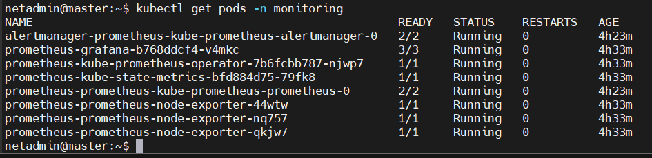

# Monitoring Kubernetes with Prometheus and Grafana

## Overview

After deploying applications to the Kubernetes cluster, the next step was to monitor their health and resource utilization.

While Kubernetes manages workloads effectively, it does not provide built-in dashboards or long-term metrics collection. To address this, I deployed the **kube-prometheus-stack** using Helm.

The stack includes Prometheus for collecting metrics, Grafana for visualization, Alertmanager for alert handling, and several exporters that gather metrics from the Kubernetes cluster.

---

# Objectives

By the end of this exercise, I had successfully:

- Installed the kube-prometheus-stack using Helm
- Verified that all monitoring components were running
- Accessed Prometheus and Grafana
- Monitored CPU and memory utilization
- Explored Kubernetes dashboards in Grafana
- Confirmed that cluster metrics were being collected successfully

---

# Installing the Prometheus Helm Repository

The kube-prometheus-stack is distributed as a Helm chart maintained by the Prometheus Community.

I first added the Helm repository and updated my local chart index.

```bash
helm repo add prometheus-community https://prometheus-community.github.io/helm-charts

helm repo update
```

---

# Deploying the Monitoring Stack

To keep monitoring resources separate from application workloads, I created a dedicated namespace named **monitoring**.

I then deployed the kube-prometheus-stack using Helm.

```bash
kubectl create namespace monitoring

helm install prometheus prometheus-community/kube-prometheus-stack \
    -n monitoring
```

The Helm chart automatically deployed several monitoring components, including:

- Prometheus Server
- Grafana
- Alertmanager
- Node Exporter
- kube-state-metrics

---

# Verifying the Deployment

After the installation completed, I confirmed that all monitoring workloads had been deployed successfully.

```bash
kubectl get pods -n monitoring
```

All Pods eventually reached the **Running** state, confirming that the monitoring stack had been installed successfully.

---

# Monitoring Components

The monitoring namespace contained all of the components responsible for collecting, storing, and visualizing cluster metrics.



---

# Verifying Monitoring Services

I inspected the Services created by the Helm chart before accessing the monitoring interfaces.

```bash
kubectl get svc -n monitoring
```

This confirmed that Prometheus, Grafana, and Alertmanager services had all been created successfully.

---

# Accessing Grafana

To access Grafana from my workstation, I exposed the Grafana service using a NodePort.

Once exposed, the web interface became accessible through the Kubernetes node.

After opening the assigned NodePort in a browser, I logged into Grafana using the credentials generated during installation.

---

# Grafana Login

The Grafana login page loaded successfully, confirming that the service was accessible from outside the cluster.

After authentication, I was able to access the monitoring dashboards.

---

# Exploring Grafana Dashboards

The kube-prometheus-stack automatically provisions several dashboards that provide insight into cluster performance.

These dashboards display information such as:

- CPU utilization
- Memory usage
- Node health
- Pod status
- Kubernetes workloads
- Cluster resource consumption

One of the most useful dashboards provided an overview of the entire Kubernetes cluster in real time.


---

# Verifying Cluster Metrics

To confirm that Prometheus was successfully collecting metrics from the cluster, I inspected node and Pod resource utilization.

```bash
kubectl top nodes

kubectl top pods -A
```

The metrics displayed by these commands matched the information presented within Grafana, confirming that Prometheus was successfully scraping cluster metrics.

---

# Verifying the Installation

Finally, I verified that the monitoring stack had been installed successfully.

```bash
helm list -A

kubectl get pods -n monitoring
```

This confirmed that the Helm release was deployed correctly and that all monitoring components remained healthy.

---

# Challenges Encountered

Deploying the monitoring stack was relatively straightforward thanks to Helm.

The biggest learning point was understanding how the different components work together:

- Prometheus collects metrics.
- Grafana visualizes those metrics.
- Alertmanager handles alert notifications.
- Exporters expose metrics from Kubernetes resources.

Seeing these services working together provided a much better understanding of Kubernetes observability.

---

# Outcome

By the end of this exercise, I had successfully deployed a complete monitoring solution for my Kubernetes cluster.

The monitoring stack provided real-time visibility into cluster health, resource utilization, and application workloads through both Prometheus and Grafana.

This monitoring environment became an essential part of the remaining project, allowing me to observe the Harbor private registry and other workloads running inside the cluster.

---

# Key Takeaways

This exercise strengthened my understanding of Kubernetes monitoring and observability.

Some of the key concepts I learned include:

- Deploying applications with Helm
- Installing the kube-prometheus-stack
- Monitoring Kubernetes workloads with Prometheus
- Visualizing metrics using Grafana
- Understanding how exporters provide cluster metrics
- Verifying resource utilization using both Grafana dashboards and `kubectl top`

Having a monitoring platform in place made it much easier to understand how workloads behaved inside the cluster and provided valuable insight into cluster performance.